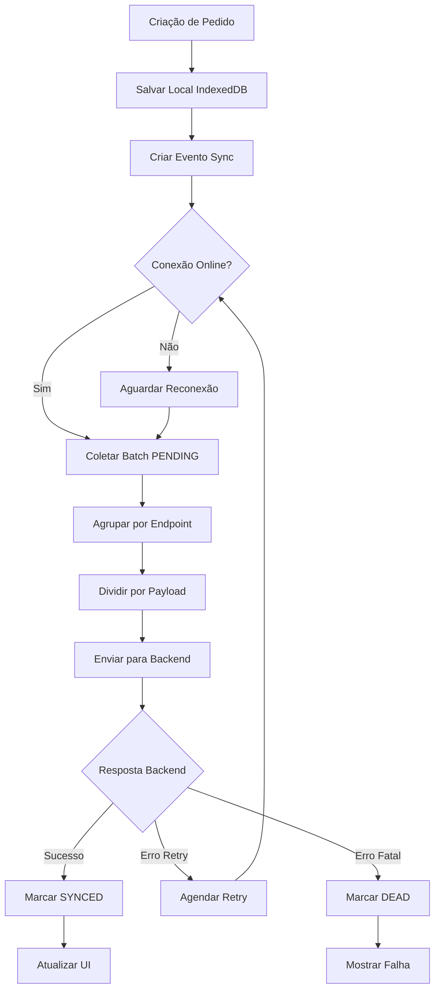

## 1. Product Overview
Sistema de fila offline-first com sincronização batch para aplicações POS (Point of Sale), garantindo funcionamento contínuo mesmo sem conexão com internet. O sistema permite criar pedidos localmente e sincroniza automaticamente com o backend quando a conexão é restaurada.

Resolve o problema de interrupção de vendas em ambientes com conectividade instável, garantindo que nenhum pedido seja perdido e mantendo a consistência dos dados entre dispositivos.

## 2. Core Features

### 2.1 User Roles
| Role | Registration Method | Core Permissions |
|------|---------------------|------------------|
| POS Operator | Device authentication | Criar pedidos offline, visualizar status de sincronização |
| Administrator | Backend registration | Gerenciar pedidos, monitorar fila de sincronização, reprocessar falhas |

### 2.2 Feature Module
O sistema consiste nos seguintes módulos principais:
1. **Criação de Pedidos**: interface para criar pedidos offline com armazenamento local
2. **Fila de Sincronização**: gerenciamento de fila local com estados de sincronização
3. **Dashboard de Sincronização**: monitoramento do status de sincronização e falhas
4. **Configurações**: gerenciamento de dispositivo e parâmetros de sincronização

### 2.3 Page Details
| Page Name | Module Name | Feature description |
|-----------|-------------|---------------------|
| Criação de Pedidos | Formulário de Pedido | Criar novos pedidos com itens, valores e informações do cliente. Salvar automaticamente no IndexedDB local |
| Criação de Pedidos | Status Offline/Online | Indicador visual do estado de conexão com backend |
| Lista de Pedidos | Pedidos Locais | Listar todos os pedidos criados localmente com status de sincronização (LOCAL_ONLY, SYNCED, ERROR) |
| Lista de Pedidos | Ações de Pedido | Visualizar detalhes, reenviar pedidos com falha, cancelar pedidos não sincronizados |
| Dashboard Sync | Fila de Sincronização | Visualizar itens pendentes, em progresso, confirmados e com falha na fila de sincronização |
| Dashboard Sync | Estatísticas de Sync | Mostrar taxa de sucesso, tempo médio de sincronização, itens processados |
| Dashboard Sync | Controles de Sync | Iniciar sincronização manual, reprocessar itens com falha, limpar fila de mortos |
| Configurações | Dispositivo | Configurar ID do dispositivo, token de autenticação, URL do backend |
| Configurações | Parâmetros de Sync | Ajustar tamanho do batch, intervalo de retry, limite de tentativas, compressão |

## 3. Core Process

### Fluxo de Criação de Pedido Offline
1. Usuário preenche formulário de pedido na interface
2. Sistema gera externalId único (UUID v4) no cliente
3. Pedido é salvo no IndexedDB local com status LOCAL_ONLY
4. Evento de sincronização é criado na fila com status PENDING
5. Sistema retorna confirmação imediata ao usuário

### Fluxo de Sincronização Batch
1. Runner detecta conexão online ou intervalo de sincronização
2. Coleta até 50 itens PENDING da fila local
3. Agrupa itens por endpoint e tipo de entidade
4. Divide em chunks respeitando limite de payload (256KB)
5. Envia batch para backend com compressão gzip opcional
6. Processa resposta item por item atualizando estados locais
7. Marca pedidos como SYNCED ou ERROR conforme resposta

### Fluxo de Tratamento de Falhas
1. Erros de rede (5xx, 429, timeout) agendam retry com backoff exponencial
2. Erros de autenticação (401/403) pausam sincronização por 60 segundos
3. Erros de validação (400) marcam item como DEAD sem retry
4. Após 10 tentativas, item é marcado como DEAD para revisão manual
5. Usuário pode reprocessar manualmente itens DEAD

## 4. User Interface Design

### 4.1 Design Style
- **Cores Primárias**: Verde (#10B981) para sucesso, Azul (#3B82F6) para primário, Vermelho (#EF4444) para erros
- **Cores Secundárias**: Cinza claro (#F3F4F6) para fundos, Cinza escuro (#6B7280) para textos secundários
- **Botões**: Estilo arredondado com sombras suaves, hover effects suaves
- **Fontes**: Inter para textos, font-size 14-16px para leitura confortável
- **Layout**: Card-based com navegação lateral, espaçamento generoso para touch
- **Ícones**: Feather Icons ou Heroicons para consistência visual

### 4.2 Page Design Overview
| Page Name | Module Name | UI Elements |
|-----------|-------------|-------------|
| Criação de Pedidos | Formulário | Cards brancos com bordas arredondadas, inputs com foco azul, botão verde grande para submit |
| Lista de Pedidos | Grid de Pedidos | Cards responsivos mostrando externalId, status colorido, timestamp, badges de sincronização |
| Dashboard Sync | Fila de Sync | Tabela com linhas alternadas, status icons, progress bars, botões de ação compactos |
| Dashboard Sync | Métricas | Cards de estatísticas com números grandes, gráficos simples de barras/donut |
| Configurações | Form Settings | Formulário vertical com labels claros, toggles para features, botão salvar azul |

### 4.3 Responsiveness
- **Desktop-first**: Otimizado para tablets e desktops em ambientes POS
- **Mobile-adaptive**: Interface se adapta para smartphones quando necessário
- **Touch-optimized**: Botões grandes (mínimo 44px), espaçamento generoso entre elementos interativos
- **Orientação**: Suporta tanto portrait quanto landscape em tablets