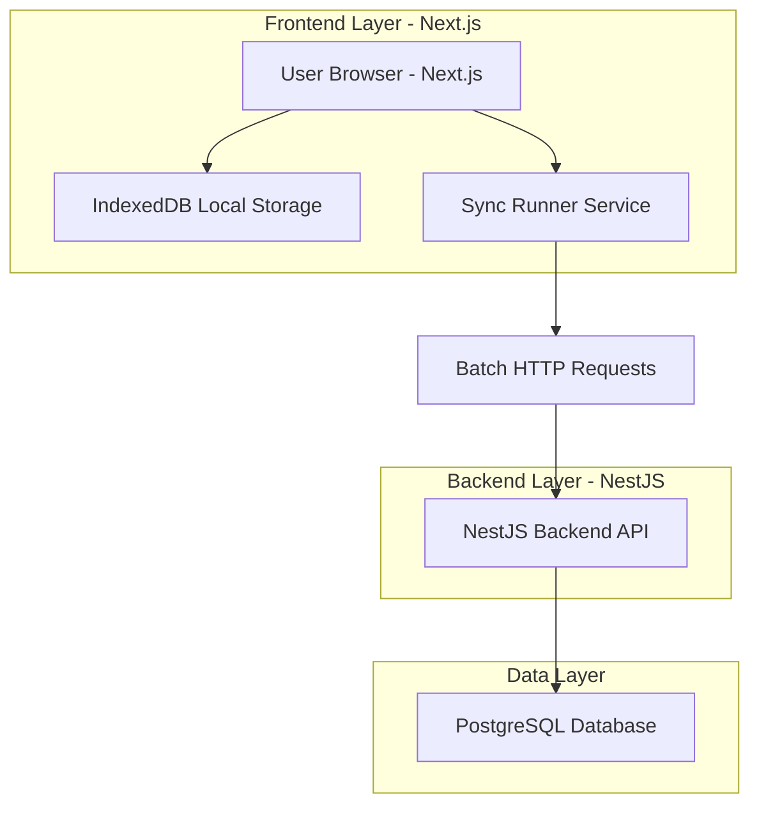
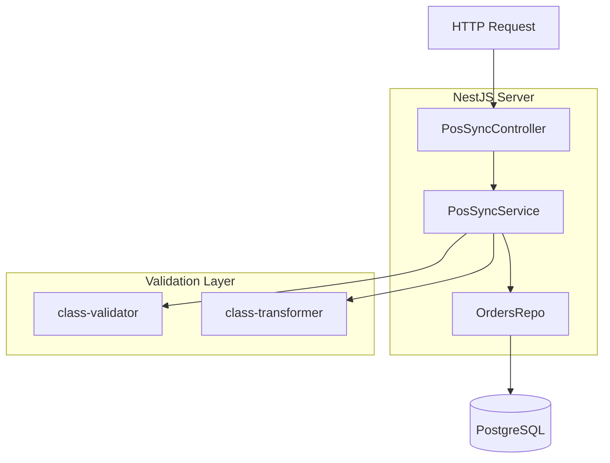
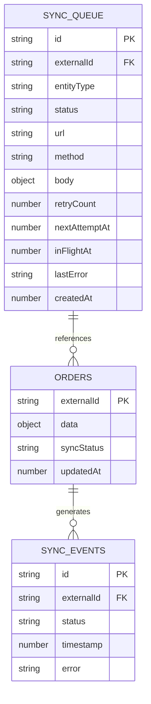

## 1. Architecture design



## 2. Technology Description

- **Frontend**: Next.js@14 + React@18 + TypeScript + TailwindCSS
- **Frontend Dependencies**: idb (IndexedDB), uuid, axios/fetch
- **Backend**: NestJS@10 + TypeScript + class-validator + class-transformer
- **Database**: PostgreSQL@16 com pool de conexões via pg
- **Initialization Tool**: create-next-app para frontend, NestJS CLI para backend
- **Storage Local**: IndexedDB para fila offline e cache de pedidos

## 3. Route definitions

### Frontend Routes (Next.js)
| Route | Purpose |
|-------|---------|
| / | Dashboard principal com status de sincronização |
| /orders | Lista de pedidos com filtros por status |
| /orders/new | Formulário de criação de novo pedido |
| /orders/[id] | Detalhes do pedido específico |
| /sync/status | Dashboard detalhado de sincronização |
| /settings | Configurações do dispositivo e sync |

### Backend Routes (NestJS)
| Route | Purpose |
|-------|---------|
| POST /admin/pos/sync | Endpoint principal para sincronização batch |
| GET /admin/pos/health | Health check do serviço |
| GET /admin/pos/metrics | Métricas de sincronização (opcional) |

## 4. API definitions

### 4.1 Sync Batch API
```
POST /admin/pos/sync
```

Request:
| Param Name | Param Type | isRequired | Description |
|------------|-------------|-------------|-------------|
| deviceId | string | true | Identificador único do dispositivo POS |
| orders | array | true | Array de objetos de pedido para sincronização |

Response:
| Param Name | Param Type | Description |
|------------|-------------|-------------|
| results | array | Array de resultados por item processado |

Example Request:
```json
{
  "deviceId": "pos-001",
  "orders": [
    {
      "externalId": "550e8400-e29b-41d4-a716-446655440000",
      "data": {
        "items": [{"sku": "PROD001", "qty": 2, "price": 10.00}],
        "total": 20.00,
        "customer": "John Doe"
      }
    }
  ]
}
```

Example Response:
```json
{
  "results": [
    {
      "externalId": "550e8400-e29b-41d4-a716-446655440000",
      "status": "created"
    }
  ]
}
```

### 4.2 Status Values
- `created`: Item criado com sucesso no backend
- `updated`: Item existente atualizado
- `duplicate`: Item idêntico já existe (nenhuma mudança)
- `invalid`: Dados inválidos (não será reprocessado)
- `auth_required`: Reautenticação necessária
- `error`: Erro genérico (pode ser reprocessado)

## 5. Server architecture diagram



## 6. Data model

### 6.1 Data model definition



### 6.2 Data Definition Language

#### Orders Table
```sql
-- create table
CREATE TABLE orders (
    id BIGSERIAL PRIMARY KEY,
    external_id UUID NOT NULL UNIQUE,
    payload JSONB NOT NULL,
    created_at TIMESTAMPTZ NOT NULL DEFAULT now(),
    updated_at TIMESTAMPTZ NOT NULL DEFAULT now()
);

-- create index
CREATE INDEX idx_orders_external_id ON orders(external_id);
CREATE INDEX idx_orders_created_at ON orders(created_at);

-- init data (exemplo)
INSERT INTO orders (external_id, payload) VALUES 
('550e8400-e29b-41d4-a716-446655440000', '{"items": [{"sku": "PROD001", "qty": 2}], "total": 20.00}');
```

#### IndexedDB Schema (Frontend)
```javascript
// Estrutura das stores do IndexedDB
const dbSchema = {
  orders: {
    keyPath: 'externalId',
    indexes: ['by-syncStatus']
  },
  syncQueue: {
    keyPath: 'id',
    indexes: ['by-status', 'by-nextAttemptAt']
  },
  locks: {
    keyPath: 'key'
  },
  dedupe: {
    keyPath: 'key'
  }
};
```

## 7. Component Architecture

### Frontend Components (React/Next.js)
- **SyncRunnerBootstrap**: Componente root que inicializa o sync runner
- **OrderForm**: Formulário de criação de pedidos
- **OrderList**: Lista de pedidos com status
- **SyncDashboard**: Dashboard de sincronização
- **SyncStatusIndicator**: Indicador visual de status

### Frontend Services
- **db.ts**: Abstração do IndexedDB com tipos TypeScript
- **enqueue.ts**: Lógica de enfileiramento com deduplicação
- **runner.ts**: Motor de sincronização com batch, retry e backoff
- **retry.ts**: Algoritmos de retry e backoff exponencial
- **lock.ts**: Sistema de locking para evitar execução paralela

### Backend Services (NestJS)
- **PosSyncController**: Controlador REST para endpoint de sync
- **PosSyncService**: Lógica de negócio para processamento batch
- **OrdersRepo**: Repository pattern para acesso a dados
- **PosSyncModule**: Módulo NestJS com configuração de dependências

## 8. Security Considerations

### Authentication
- JWT Bearer token via Authorization header
- Device ID único por POS para rastreamento
- Pausa automática de sincronização em caso de 401/403

### Data Validation
- Validação de externalId como UUID válido
- Sanitização de payload JSON no backend
- Limite de tamanho de payload (256KB default)

### Rate Limiting
- Backoff exponencial com jitter para evitar thundering herd
- Limite de retry (10 tentativas default)
- Agrupamento por endpoint para otimização

## 9. Performance Optimization

### Batch Processing
- Tamanho de batch configurável (default 50 itens)
- Agrupamento por endpoint e tipo de entidade
- Compressão gzip opcional para reduzir tráfego

### Local Storage
- IndexedDB para armazenamento persistente
- Índices otimizados para queries frequentes
- Deduplicação local para evitar duplicatas

### Network Optimization
- Retry com backoff exponencial e jitter
- Limite de payload por request
- Timeout configurável para requests